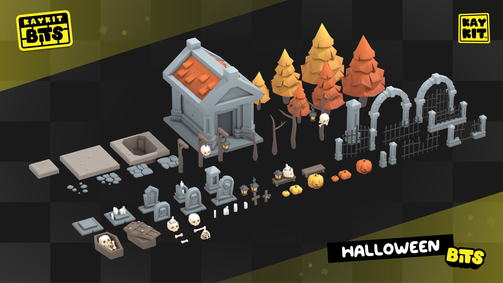
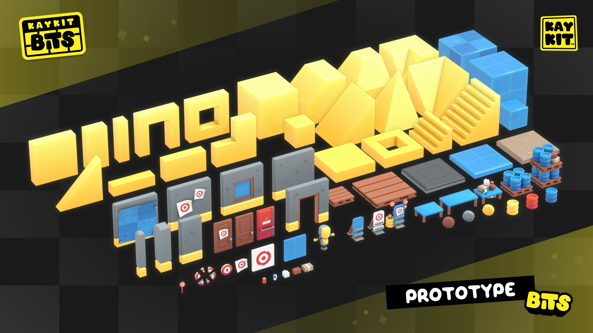
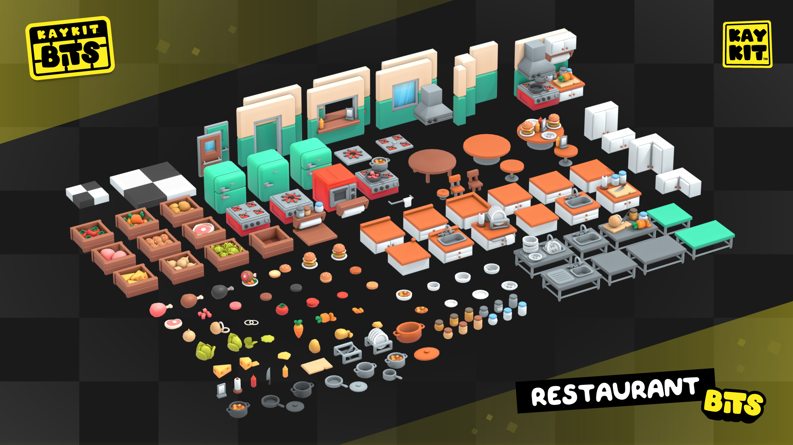
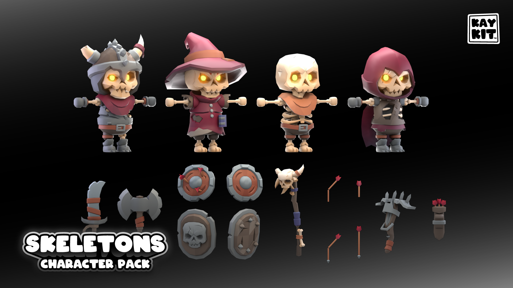

# DPEV_DungeonCrawler
 Diplomatura en Programacion de Entornos Virtuales - Dungeon Crawler

Proyecto Practico para la  Diplomatura en Programacion de Entornos Virtuales
Tematica "Dungeon Crawler"

## Integrantes del grupo:
- [Leiva, Miguel](https://github.com/IskandarConqueror)
- [Cha, Sebastian](https://github.com/NQNseba)
- [Karcz, Agustin](https://github.com/AgustinKarcz)
- [Gregorio, Jeremias Ezequiel](https://github.com/JeremyGregorio)

## Licencias y Assets:
Assets gratuitos de [KayKit](https://kaylousberg.com/game-assets)

[Licencia](Assets/Licencias/KayKit_Adventurers_Pack-License.txt)

[Licencia](Assets/Licencias/KayKit_DungeonRemastered_1.1-License.txt)

[Licencia](Assets/Licencias/KayKit_HalloweenBits_1.0-License.txt)

[Licencia](Assets/Licencias/KayKit_Prototype_Bits_1.0-License.txt)

[Licencia](Assets/Licencias/KayKit_Restaurant_Bits_1.0-License.txt)

[Licencia](Assets/Licencias/KayKit_Skeletons_1.0-License.txt)
